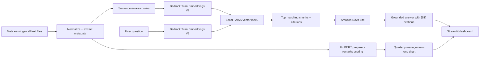

# FinSight

FinSight is an AI-powered equity-research assistant for exploring earnings-call transcripts with source-cited answers. It combines semantic retrieval, Bedrock-powered RAG, market-risk analytics, and quarterly management-tone trends in one Streamlit dashboard.

The current portfolio build focuses on Meta earnings calls from Q3 2018 through Q4 2025. It is designed to demonstrate a reliable research workflow—not to provide investment advice or real-time institutional market data.

## What it does

- Answers natural-language questions about management commentary using retrieved transcript evidence.
- Shows a concise Amazon Nova Lite answer alongside the original supporting passages.
- Uses `[S1]`, `[S2]`, and similar labels to connect answer claims to visible source excerpts.
- Displays two years of adjusted price history, annualized return, volatility, and Sharpe ratio.
- Scores prepared remarks with FinBERT and charts quarter-over-quarter management tone.

## Architecture



## Tech stack

| Area | Technology |
|---|---|
| App and charts | Streamlit, Plotly |
| Transcript processing | Python, pandas |
| Embeddings | Amazon Bedrock Titan Text Embeddings V2 |
| Answer generation | Amazon Bedrock Amazon Nova Lite |
| Vector search | FAISS |
| Tone analysis | ProsusAI FinBERT / Hugging Face Transformers |
| Market data | yfinance |

## RAG workflow

1. Raw transcript files are normalized into a standard call schema with ticker, date, quarter, year, source ID, and text.
2. Calls are split into sentence-aware chunks of up to 800 words, preserving overlap and source metadata.
3. Amazon Titan embeds every chunk into a 1,024-dimension vector stored in a local FAISS index.
4. A submitted question is embedded with the same Titan model and compared against all indexed chunks using cosine-similarity ranking.
5. The strongest passages are passed to Amazon Nova Lite, which is instructed to answer only from that evidence and cite source labels.
6. The app shows the answer and the original, inspectable transcript evidence together.

## Local setup

### 1. Create and activate a virtual environment

```bash
python3 -m venv .venv
source .venv/bin/activate
python -m pip install -r requirements.txt
```

### 2. Configure environment variables

Copy the example file:

```bash
cp .env.example .env
```

Set the values below in `.env`:

```dotenv
AWS_REGION=us-east-1
AWS_PROFILE=finsight-dev
BEDROCK_EMBEDDING_MODEL_ID=amazon.titan-embed-text-v2:0
BEDROCK_CHAT_MODEL_ID=amazon.nova-lite-v1:0
DEFAULT_TICKERS=META
```

Use an AWS profile with `bedrock:InvokeModel` permission for both Bedrock models. Keep access keys in your local AWS CLI profile—not in `.env` and never in Git.

### 3. Add the raw transcript corpus

Download the Meta earnings-call transcript corpus and place its `.txt` files here:

```text
data/raw/META_EarningsCallTranscripts/
```

Raw and processed data are excluded from Git. See [data source notes](docs/data_sources.md) for license and attribution guidance.

### 4. Build local data artifacts

```bash
python scripts/build_chunks.py
python scripts/build_vector_index.py
python scripts/build_sentiment_scores.py
```

This produces:

```text
data/processed/transcript_chunks.jsonl
data/processed/faiss_index/transcript_chunks.faiss
data/processed/faiss_index/transcript_chunks.metadata.jsonl
data/processed/quarterly_sentiment.csv
```

The first FinBERT run downloads the model locally. The first vector-index run makes one Bedrock embedding request per transcript chunk.

### 5. Run the dashboard

```bash
python -m streamlit run app/streamlit_app.py
```

Try a question such as:

```text
What did management say about AI infrastructure investment?
```

## Interpreting management tone

FinSight scores the prepared-remarks portion of each call with FinBERT. The trend chart shows:

```text
net tone = average positive probability − average negative probability
```

This is a language signal intended to highlight changes worth investigating in the primary source; it is not a forecast, recommendation, or measure of company performance.

## Project status

Implemented locally:

- Transcript ingestion for 30 Meta earnings calls
- 461 source-citable retrieval chunks
- Bedrock Titan embeddings and FAISS semantic retrieval
- Bedrock Nova Lite grounded answer generation
- FinBERT quarterly prepared-remarks tone scoring
- Streamlit market, transcript, RAG, and sentiment dashboard

Planned for a production-scale iteration:

- Amazon S3 storage for raw and processed artifacts
- Amazon OpenSearch Serverless in place of local FAISS
- Automated ingestion and indexing
- Multiple-company corpus and authentication

## Disclaimer

FinSight is an educational portfolio project. It is not investment advice. Market data is used for demonstration purposes, and generated answers should always be verified against the cited source passages.
